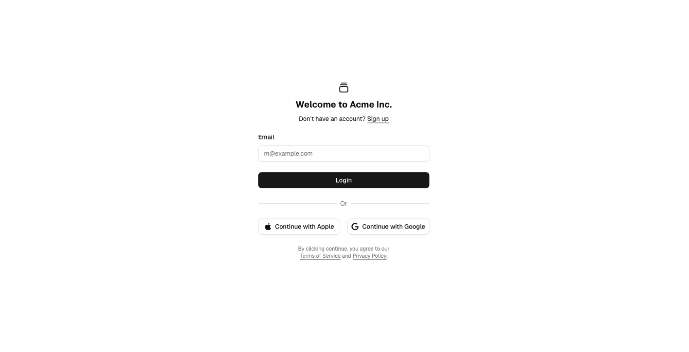
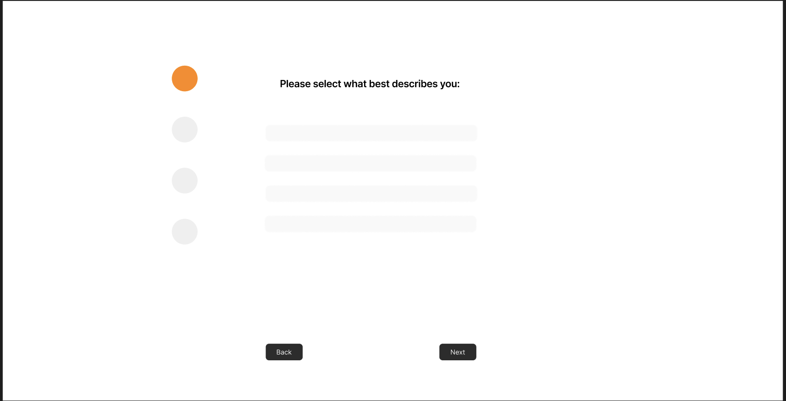
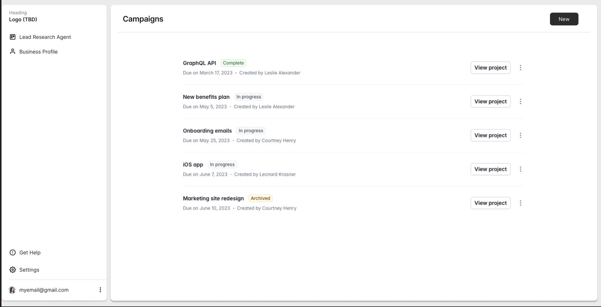
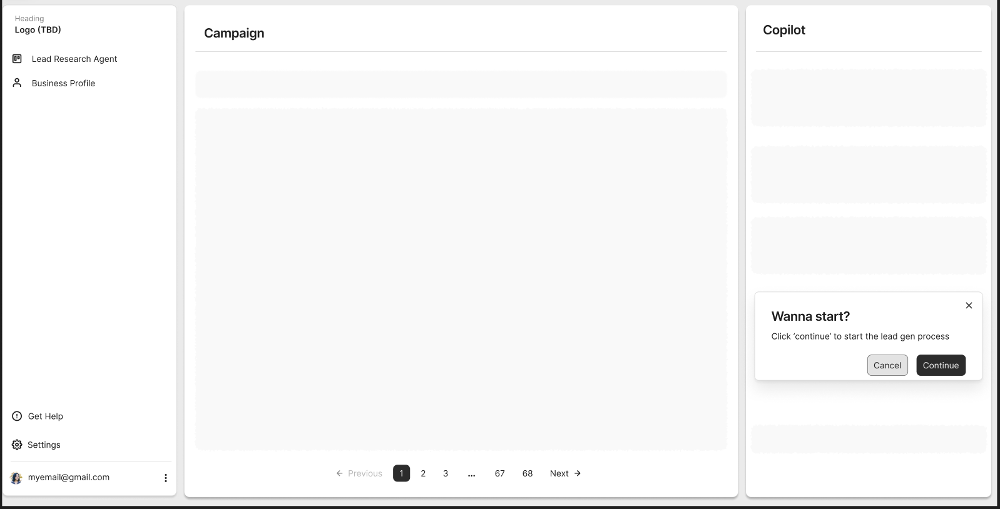
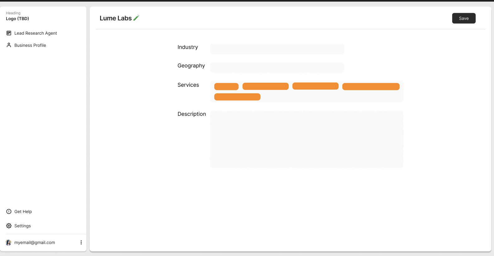
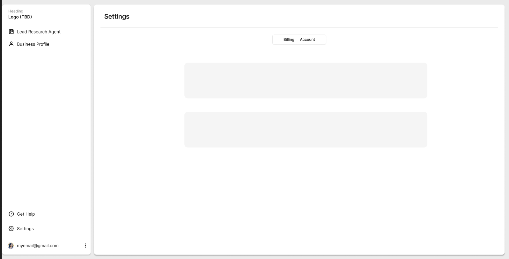

# Product Requirements Document (PRD)

**Product Name:** Lead Research Copilot
**Version:** MVP

## 1. **Vision & Goal**

To automate the process of sourcing and qualifying leads for agencies, businesses, and HR teams, by using an AI Copilot that pulls data primarily from **LinkedIn** and **public company websites**. The system will generate a **qualified list of leads** with context and allow users to query the agent for further enrichment (e.g., personalized outreach hooks).

## 2. **Objectives**

* Provide **cost-effective lead sourcing** (LinkedIn + public data first, optional enrichment via Apollo/Clearbit if required).
* Deliver a list of **qualified, enriched, and verified leads**.
* Allow the user to **interact with the lead dataset via the copilot** (e.g., add columns, generate outreach hooks).
* Enable **multi-channel notifications** (in-app + email).

## 3. **Target Users**

* Marketing & Sales Agencies
* B2B Businesses
* Recruiters / HR Teams
* Startup Founders

## 4. **MVP Scope**

### 4.1 Authentication & Onboarding

* Google OAuth (MVP).
* Profile setup: User gives business/agency info + goals (context for lead qualification).

### 4.2 Lead Sourcing & Copilot Flow

1. **Define ICP**

   * User enters ICP details (role, industry, location, company size, etc.) via form or chat-like Q\&A with agent.

2. **Trigger Copilot**

   * Runs asynchronously, sourcing leads from:

     * **LinkedIn profiles** (public data / scraping / API if feasible).
     * **Public company websites**.
     * **Optional**: Apollo/Clearbit (if needed to verify emails).
   * Verified emails required (bounce protection).

3. **Notifications**

   * **In-app** and **email notification** when process is complete.

4. **Lead Results Table**
   Each lead must include:

   * First Name
   * Last Name
   * Verified email
   * LinkedIn profile
   * Company name
   * Role/title
   * Website
   * “About” summary
   * Data points with links (e.g., LinkedIn posts, company updates)
   * Qualification reason (AI-generated)
   * Interest rating (1–10)
   * **Agent interaction enabled:** User can ask Copilot to enrich data (e.g., *“Add a Hook column with a personalized outreach message”*).

5. **Download & Export**

   * Leads exportable to **CSV**.

## 5. **Non-Functional Requirements**

* **Cost Efficiency:** Prefer free/public sources, use paid APIs (Apollo/Clearbit) only when strictly necessary.
* **Scalability:** Handle parallel searches asynchronously.
* **Accuracy:** Verify email validity.
* **Performance:** Initial sourcing may take minutes depending on depth.
* **Security:** Encrypt user data and lead lists.

## 6. **Future Enhancements (Beyond MVP)**

* ICP templates (save & reuse).
* CRM integrations (HubSpot, Salesforce).
* Team collaboration & shared ICPs.
* Automated lead updates (continuous enrichment).
* Advanced filtering (funding stage, hiring signals, tech stack).

## 7. **Success Metrics**

* % of verified leads (bounce rate <5%).
* User rating of lead quality (>7/10).
* % of users exporting data or requesting hooks.
* Retention (# of repeated searches per user).

## 8. **Tech Stack (Proposed for MVP)**

* **Frontend:** React (Next.js), TailwindCSS, Shadcn**
* **Backend:** Node.js (Express)
* **Database:** PostgreSQL
* **Lead Sourcing:**

  * LinkedIn scraping (public data)
  * Company websites (scraping + enrichment)
  * Apollo/Clearbit (only for verified email if needed)
* **AI Agent:** OpenAI (GPT-4.1-mini / GPT-4.1), LangChain for enrichment + table manipulations
* **Auth:** Google OAuth (via Supabase/Auth0/Firebase)
* **Notifications:** Email (SendGrid/Resend) + in-app alerts

## Interaction Flow
- The user requests a new 'Lead Campaign'
- A new window gets opened with the copilot chat on the right side
- The user gives a description of the ICP for this new lead campaign and this starts a short interaction with agent to clarify all details of the ICP
- Once the Copilot believes that the gathered data is sufficient it will start the research asynchronously
- The Copilot will research and gather a list leads that meet the criteria
- Once the list has been collected it will proceed to research each lead more in depth to find data points that would make the copilot believe they are a great fit for what the user offers
    -  The goal is to find leads that will very likely be interested in what the users agency, business or company, has to offer.
- Once the list is gathered the copilot will notify the user via email and through the UI

## Design Guidelines
- Color palette: 
    - Black (#000000)
    - White (#FFFFFF)
    - Orange as the accent color (**#**FF8904 **or** oklch(75% .183 55.934))
    - Gray (TBD)
    - Zinc (#f4f4f5)
- UI inspiration: "Clean, modern dashboard using schadcn components"
- Flexibility: "Use these as directional guidance - optimize for usability and development efficiency"
- Mockups:

**Login**

**Onboarding**

**Campaign Management**

**Lead Campaign Interface/Copilot interaction**

**Business Profile**

**Settings**
